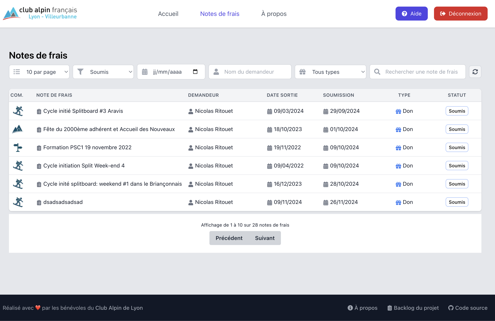

# Outil de Compta du Club Alpin de Lyon

Cette application est une interface utilisateur (UI) permettant aux membres du Club Alpin de Lyon de soumettre et de gérer leurs notes de frais. Elle facilite également la gestion comptable pour les bénévoles responsables.
Les notes de frais sont soumises par les encadrants sur le site web du Club Alpin de Lyon.

> ⚠️ **Note importante** : Cette application s'appuie sur [l'API du site web du Club Alpin de Lyon](https://www.clubalpinlyon.fr/api) pour récupérer les données et gérer l'authentification.



## **✨ Fonctionnalités principales**

- 👀 Visualisation des notes de frais par les encadrants.
- ✅ Validation des demandes de remboursement par les administrateurs.
- 📜 Visualisation de l'historique des frais.
- 🔔 Notifications pour les actions à effectuer.

## **🚀 Prérequis**

Avant de commencer, assurez-vous d'avoir les outils suivants installés sur votre machine :
- **Node.js** (version recommandée : 20.x ou supérieure)
- **pnpm**
- Un accès fonctionnel à l'API backend du site web du Club Alpin de Lyon.

## **⚙️ Installation**

### **💻 En local**

1. Clonez ce dépôt :
   ```bash
   git clone https://github.com/Club-Alpin-Lyon-Villeurbanne/compta-club.git
   cd compta-club
   ```

2. Installez les dépendances :
   ```bash
   pnpm install
   ```

3. Configurez les variables d'environnement en créant un fichier `.env` à la racine du projet avec les valeurs suivantes :
   ```env
   NEXT_PUBLIC_BACKEND_BASE_URL=http://localhost:8000/api
   NEXTAUTH_URL=http://localhost:3000
   NEXTAUTH_SECRET=topsecret
   NEXT_PUBLIC_WEBSITE_BASE_URL=https://www.clubalpinlyon.top
   ```

   > 💡 **Astuce :** Assurez-vous que l'API backend est opérationnelle à l'URL spécifiée dans `NEXT_PUBLIC_BACKEND_BASE_URL`.

4. Lancez le serveur de développement :
   ```bash
   pnpm dev
   ```

5. Accédez à l'application à l'adresse suivante :  
   [http://localhost:3000](http://localhost:3000)

6. Authentifiez-vous avec votre compte sur [l'environnement de test du site web du Club Alpin de Lyon](https://www.clubalpinlyon.top/).

### **🚀 Déploiement sur Vercel**

Le déploiement se fait sur vercel automatiquement lorsque des modifications sont poussées sur la branche `main`. Vérifiez que le projets build correctement en lancant `pnpm build` et en vérifiant que le build se passe sans erreur.

## **🤝 Contribution**

Nous accueillons volontiers les contributions ! Voici comment vous pouvez aider :

### **📝 Processus de contribution**

1. **Forkez** ce dépôt.
2. Créez une nouvelle branche pour votre fonctionnalité ou correction :
   ```bash
   git checkout -b feature/ma-nouvelle-fonctionnalite
   ```
3. Faites vos modifications et testez-les localement.
4. Commitez vos changements avec un message clair :
   ```bash
   git commit -m "Ajout : nouvelle fonctionnalité pour X"
   ```
5. Poussez votre branche vers votre dépôt forké :
   ```bash
   git push origin feature/ma-nouvelle-fonctionnalite
   ```
6. Ouvrez une **pull request** depuis GitHub.

### **📋 Conventions**

- Respectez les bonnes pratiques de code.
- Assurez-vous que vos modifications passent tous les tests existants.
- Suivez les conventions de nommage des branches (`feature/`, `fix/`, etc.).

## **🧪 Tests**

Actuellement, aucun test n'est implémenté.

## **🏗️ Architecture technique**

### **🛠️ Technologies utilisées**
- **Frontend** : Next.js
- **Authentification** : NextAuth
- **Backend** : API du site web du Club Alpin de Lyon (non inclus dans ce projet)

### **📁 Structure du projet**
- `/app` : Dossier principal contenant les routes et composants de l'application
  - `/(public)` : Routes publiques (accueil, à propos, etc.)
  - `/(protected)` : Routes protégées nécessitant une authentification
  - `/api` : Routes API de l'application
  - `/components` : Composants réutilisables
  - `/lib` : Utilitaires, hooks et configurations
  - `/types` : Types TypeScript partagés
- `/public` : Assets statiques (images, fonts, etc.)

## **📬 Contact**

Pour toute question, suggestion ou problème, vous pouvez :
- 🐛 Ouvrir une issue sur [GitHub](https://github.com/Club-Alpin-Lyon-Villeurbanne/compta-club/issues).
- 📧 Contacter l'équipe via [numerique@clubalpinlyon.fr](mailto:numerique@clubalpinlyon.fr).
