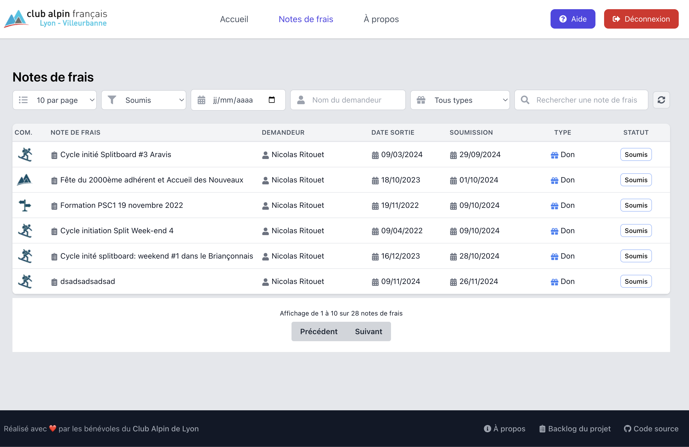

# Outil de Compta du Club Alpin de Lyon

Cette application est une interface utilisateur (UI) permettant aux membres du Club Alpin de Lyon de soumettre et de gérer leurs notes de frais. Elle facilite également la gestion comptable pour les bénévoles responsables.
Les notes de frais sont soumises par les encadrants sur le site web du Club Alpin de Lyon.

> ⚠️ **Note importante** :
> - Cette application s'appuie sur [l'API du site web du Club Alpin de Lyon](https://www.clubalpinlyon.fr/api) pour récupérer les données et gérer l'authentification.
> - Pour plus de détails sur les endpoints et leur usage, consultez la [documentation de l'API](./API.md).



## **✨ Fonctionnalités principales**

- 👀 Visualisation des notes de frais par les encadrants.
- ✅ Validation des demandes de remboursement par les administrateurs.
- 📜 Visualisation de l'historique des frais.
- 🔔 Notifications pour les actions à effectuer.
- 📄 Export PDF des notes de frais approuvées/comptabilisées.

## **🚀 Prérequis**

Avant de commencer, assurez-vous d'avoir les outils suivants installés sur votre machine :
- **Node.js** (version recommandée : 20.x ou supérieure)
- **pnpm**
- Un accès fonctionnel à l'API backend du site web du Club Alpin de Lyon.

## **⚙️ Installation**

### **💻 En local**

1. Clonez ce dépôt :
   ```bash
   git clone https://github.com/Club-Alpin-Lyon-Villeurbanne/compta-club.git
   cd compta-club
   ```

2. Installez les dépendances :
   ```bash
   pnpm install
   ```

3. Configurez les variables d'environnement en créant un fichier `.env` à la racine du projet (copiez `.env.exemple`) et ajoutez les variables suivantes :
   ```bash
   cp .env.exemple .env.local
   ```
   
   Puis modifiez `.env.local` selon vos besoins :
   ```env
   NEXT_PUBLIC_BACKEND_BASE_URL=http://localhost:8000/api
   NEXT_PUBLIC_WEBSITE_BASE_URL=http://localhost:3000
   NEXT_PUBLIC_API_URL=http://localhost:8000/api
   NEXT_PUBLIC_CLUB_NAME="Nom de votre club"  # Optionnel, par défaut "CLUB ALPIN DE LYON"
   ```

   > 💡 **Astuce :** Assurez-vous que l'API backend est opérationnelle à l'URL spécifiée dans `NEXT_PUBLIC_BACKEND_BASE_URL`.

4. Lancez le serveur de développement :
   ```bash
   pnpm dev
   ```

5. Accédez à l'application à l'adresse suivante :  
   [http://localhost:3000](http://localhost:3000)

6. Authentifiez-vous avec votre compte sur [l'environnement de test du site web du Club Alpin de Lyon](https://www.clubalpinlyon.top/).

### **🚀 Déploiement sur Vercel**

Le déploiement se fait sur vercel automatiquement lorsque des modifications sont poussées sur la branche `main`. Vérifiez que le projets build correctement en lancant `pnpm build` et en vérifiant que le build se passe sans erreur.

## **🤝 Contribution**

Nous accueillons volontiers les contributions ! Voici comment vous pouvez aider :

### **📝 Processus de contribution**

1. **Forkez** ce dépôt.
2. Créez une nouvelle branche pour votre fonctionnalité ou correction :
   ```bash
   git checkout -b feature/ma-nouvelle-fonctionnalite
   ```
3. Faites vos modifications et testez-les localement.
4. Commitez vos changements avec un message clair :
   ```bash
   git commit -m "Ajout : nouvelle fonctionnalité pour X"
   ```
5. Poussez votre branche vers votre dépôt forké :
   ```bash
   git push origin feature/ma-nouvelle-fonctionnalite
   ```
6. Ouvrez une **pull request** depuis GitHub.

### **📋 Conventions**

- Respectez les bonnes pratiques de code.
- Assurez-vous que vos modifications passent tous les tests existants.
- Suivez les conventions de nommage des branches (`feature/`, `fix/`, etc.).

## **🧪 Tests**

### **Tests unitaires avec Vitest**

```bash
# Lancer les tests unitaires
pnpm test:unit

# Mode watch (relance automatique)
pnpm test:unit:watch
```

Les tests unitaires couvrent :
- Routes API (auth, expense-reports)
- Utilitaires fetch (client/serveur)
- Fonctions d'authentification
- Helpers et store Zustand

### **Tests E2E avec Playwright**

Les tests end-to-end sont implémentés avec Playwright. Ils n'ont besoin ni du backend ni d'identifiants : Playwright démarre un faux backend (`tests/mocks/fake-backend.ts`, données dans `tests/mocks/fixtures.ts`) et un serveur de dev sur le port 3100 qui pointe dessus.

1. Lancez les tests avec la commande :
   ```bash
   pnpm test:e2e
   ```

2. Pour lancer les tests avec l'interface utilisateur de Playwright :
   ```bash
   pnpm test:e2e:ui
   ```

Les tests E2E vérifient le flux d'authentification et d'autres fonctionnalités principales de l'application.

## **🏗️ Architecture technique**

### **🛠️ Technologies utilisées**
- **Frontend** : Next.js 15 (App Router)
- **Authentification** : JSON Web Tokens (JWT) via cookies httpOnly gérés par des routes API Next.js
- **Backend** : API du site web du Club Alpin de Lyon (https://www.clubalpinlyon.fr/api)
- **State Management** : Zustand
- **Styling** : Tailwind CSS + shadcn/ui
- **PDF Generation** : jsPDF + jspdf-autotable
- **Monitoring** : Sentry (production)

### **📁 Structure du projet**
- `/app` : Code source Next.js (App Router)
  - `/(public)`  : Pages accessibles sans authentification (home, à propos, aide)
  - `/(private)` : Pages protégées (gestion des notes de frais)
  - `/api`     : Routes API internes (auth, expense-reports)
  - `/components` : Composants spécifiques à l'application
  - `/lib`      : Utilitaires partagés (fetchClient, fetchServer, auth, constants)
  - `/store`    : Zustand store (état des filtres & pagination)
  - `/enums`, `/interfaces` : Types TypeScript (ExpenseReport, User, etc.)
  - `/utils`    : Utilitaires (helper, pdfGenerator)
- `/components/ui` : Composants UI réutilisables (tables, formulaires...)  
- `/public`       : Assets statiques (images, favicon, etc.)
- `/tests`        : Tests (unit avec Vitest, E2E avec Playwright)

## **🔧 Scripts disponibles**

| Commande | Description |
|----------|-------------|
| `pnpm dev` | Serveur de développement |
| `pnpm build` | Build production |
| `pnpm start` | Serveur production |
| `pnpm lint` | Linter ESLint |
| `pnpm test:unit` | Tests unitaires (Vitest) |
| `pnpm test:e2e` | Tests E2E (Playwright) |

## **🤖 Outils de développement**

- **Claude Code** : Le fichier [CLAUDE.md](./CLAUDE.md) contient les instructions pour utiliser Claude Code sur ce projet.
- **CI/CD** : GitHub Actions exécute lint, tests et build sur chaque PR.
- **CodeRabbit** : Review automatique des PRs.
- **Vercel** : Déploiement automatique + preview sur chaque PR.

## **📬 Contact**

Pour toute question, suggestion ou problème, vous pouvez :
- 🐛 Ouvrir une issue sur [GitHub](https://github.com/Club-Alpin-Lyon-Villeurbanne/compta-club/issues).
- 📧 Contacter l'équipe via [numerique@clubalpinlyon.fr](mailto:numerique@clubalpinlyon.fr).

## **📄 Documentation complémentaire**

- [CLAUDE.md](./CLAUDE.md) - Instructions pour Claude Code
- [CONTRIBUTING.md](./CONTRIBUTING.md) - Guide de contribution détaillé
- [API.md](./API.md) - Endpoints API utilisés par cette application